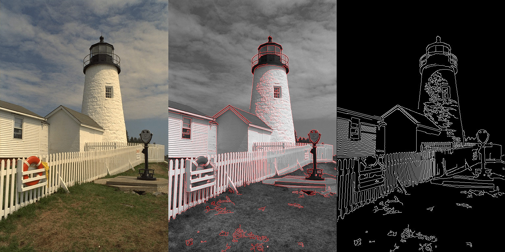

# Parallel Canny Edge Detector




This repository contains a semestral project for the **NI-GPU** course focusing on the parallelization of the Canny edge detector using NVIDIA CUDA technology.

---

## Contents

- `cuda/` - Directory containing the parallel CUDA implementation.
- `images/` - Directory containing input testing images.
- `output/` - Directory containing logs and benchmarks of measured test runs.
- `sequential/` - Directory containing the baseline sequential C++ implementation.
- `report.pdf` - The detailed project report document (*only in czech*).

---

## Compilation

Both implementations contain their own native `Makefile` within their respective directories. To compile the source files, navigate to the desired directory and execute the `make` command:

```bash
# To compile the sequential version
cd sequential
make

# To compile the parallel CUDA version
cd cuda
make
```

Upon successful compilation, the following executable binaries will be generated:

- `canny_sequential`
- `canny_cuda`

---

## Usage Guide

### Important Note on Image Formats

Both programs work exclusively with **Truevision TGA (TARGA)** images (files ending with the `.tga` extension). The engine automatically parses the file headers and converts the color data to grayscale during input stream processing using the following luminance weighting:

$$ \text{Gray} = 0.299R + 0.587G + 0.114B $$

### Execution Syntax

```bash
# To execute the sequential version
./canny_sequential <image_path> <sigma> <lower_threshold> <upper_threshold>

# To execute the parallel CUDA version
./canny_cuda <image_path> <sigma> <lower_threshold> <upper_threshold> <2D_block_width> <2D_block_height> <1D_block_size>
```

#### Parameter Breakdown:

- **`image_path`**: Path to the target input image file (must be a `.tga` file).
- **`sigma`**: The $\sigma$ coefficient steering the size and weights of the $5\times5$ Gaussian Blur convolution kernel.
- **`lower_threshold`** & **`upper_threshold`**: The low and high limits used during double thresholding to map weak and strong edges. These values must be provided as percentages ranging from `0.0` to `1.0` (relative to the maximum gradient intensity found in the image).
- **`2D_block_width`** & **`2D_block_height`**: The horizontal and vertical dimensions determining the execution layout shape of the two-dimensional CUDA thread blocks. Recommended default is `16 16` for optimal warp alignment.
- **`1D_block_size`**: The linear size defining thread counts for one-dimensional CUDA blocks (used exclusively during the double thresholding and hysteresis cleanup phases).

### Output Results

When processing is complete, the application generates **two distinct output image files** inside the directory of the original asset, suffixed as follows:

- **`_only_edges.tga`**: Displays only the finalized sharp traced edges highlighted in solid white over a clean black background.
- **`_edges.tga`**: Displays the original asset converted into standard grayscale with all confirmed edges highlighted in bright red pixels.

---

## Benchmark Highlights (8K Image Processing)

As detailed in the included `report.pdf`, the parallel CUDA algorithm swaps traditional serial Depth-First Search (DFS) edge tracking with an iterative joint block-shared memory loop. 

When tested with an 8K image ($7680\times4320$ pixels) across different hardware configurations, the execution speeds vary dramatically based on your thread geometry selections:

* **Sequential Baseline**: Processing on an AMD Ryzen 7 7800X3D CPU takes an average of **2126.34 ms**.
* **CUDA Gold Standard ($16\times16$ Blocks)**: Running on an NVIDIA GeForce RTX 4070 GPU finishes the exact same 8K workspace in just **17.52 ms**. This yields an **approximate 121x performance speedup**, enabling real-time edge tracing.
* **Hardware Warning Pitfalls**: The report demonstrates major performance penalties if hardware constraints are broken, such as **Warp Misalignment** ($15\times15$ configurations), **Occupancy Starvation** ($8\times8$ blocks), or **Register Spilling** onto VRAM when maxing out consumer limits at $32\times32$ threads.
